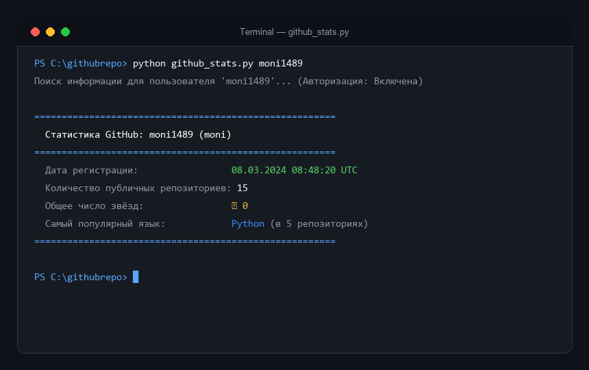

# 📊 GitHub User Statistics CLI

Консольная утилита на Python для сбора и отображения ключевой статистики любого пользователя GitHub через официальный GitHub REST API.



---

## 📌 Что делает проект

Скрипт принимает имя пользователя (логин) GitHub и выводит сводную аналитическую карточку:
- 📅 **Дату регистрации аккаунта** (в формате UTC).
- 📦 **Количество публичных репозиториев** пользователя.
- ⭐ **Общее число звёзд (Stargazers)**, суммарно набранных по всем репозиториям.
- 💻 **Самый популярный язык программирования** (определяется частотным анализом по всем репозиториям с указанием их точного количества).

---

## 🔌 Какой GitHub API используется

Проект взаимодействует с официальным **GitHub REST API** (версия API `2022-11-28`):

1. **`GET https://api.github.com/users/{username}`**
   - Получение основной информации профиля: имя, логин, дата регистрации (`created_at`), счётчик публичных репозиториев (`public_repos`).
2. **`GET https://api.github.com/users/{username}/repos`**
   - Получение списка репозиториев пользователя с параметрами `per_page=100` и `type=owner`.
   - **Автоматическая пагинация**: обработка заголовка ответа `Link: <url>; rel="next"`, что позволяет корректно подсчитывать звёзды и языки даже для пользователей с сотнями и тысячами репозиториев.
3. **Авторизация**:
   - Передача заголовка `Authorization: Bearer <token>`.
   - Без токена GitHub API ограничивает запросы до **60 в час** на IP-адрес.
   - С персональным токеном лимит расширяется до **5000 запросов в час**.

---

## 🚀 Быстрый старт

### 1. Клонирование репозитория

```bash
git clone https://github.com/moni1489/githubrepo.git
cd githubrepo
```

### 2. Установка зависимостей

Убедитесь, что установлен Python 3.10+ и выполните установку библиотек:

```bash
pip install -r requirements.txt
```

### 3. Настройка переменных окружения (.env)

1. Скопируйте шаблон конфигурации:
   ```bash
   cp .env.example .env
   ```
2. Откройте файл `.env` и вставьте ваш Personal Access Token:
   ```env
   GITHUB_TOKEN=your_token_here
   ```

> 💡 **Как получить токен?**
> 1. Перейдите в [GitHub Settings → Developer Settings → Personal access tokens](https://github.com/settings/tokens).
> 2. Создайте `Fine-grained token` или `Classic token` (для чтения публичных данных права/scopes не требуются).

### 4. Запуск скрипта

Передайте имя интересующего пользователя в качестве аргумента:

```bash
python github_stats.py <username>
```

#### Примеры запуска:

```bash
# Проверка пользователя octocat
python github_stats.py octocat

# Проверка вашего профиля
python github_stats.py moni1489

# Передача токена напрямую через флаг
python github_stats.py torvalds --token ghp_your_token_here
```

---

## 🖥️ Пример вывода в терминале

```text
Поиск информации для пользователя 'moni1489'... (Авторизация: Включена)

=======================================================
  Статистика GitHub: moni1489 (moni)
=======================================================
  Дата регистрации:                 08.03.2024 08:48:20 UTC
  Количество публичных репозиториев: 15
  Общее число звёзд:                ⭐ 0
  Самый популярный язык:            Python (в 5 репозиториях)
=======================================================
```

---

## ⚙️ Дополнительные параметры

Скрипт снабжён встроенной справкой:

```bash
python github_stats.py --help
```

```text
usage: github_stats.py [-h] [--token TOKEN] username

CLI-утилита для отображения статистики пользователя GitHub.

positional arguments:
  username           Имя пользователя (login) GitHub

options:
  -h, --help         show this help message and exit
  --token, -t TOKEN  Personal access token (если не указан, берется из
                     переменной окружения GITHUB_TOKEN или GH_TOKEN)
```

В репозитории также доступен альтернативный вариант скрипта на базе библиотеки **PyGithub** — [`github_stats_pygithub.py`](github_stats_pygithub.py).
